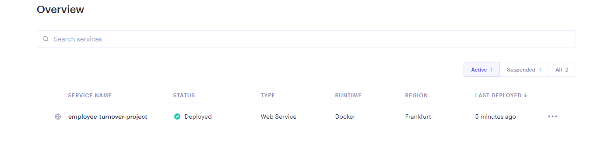
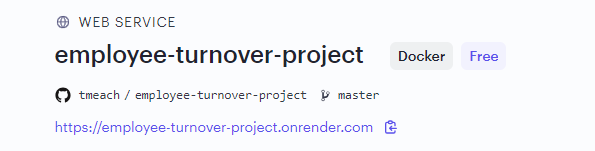

## Capstone project - Employee turnover Prediction


### Overview

This is an end-to-end machine learning project that encompasses model training and deployment.

This project encompasses the following stages:

- Project Overview: Provide a comprehensive project description, including an explanation of how the developed model can be applied in practical scenarios.

- Data Preparation and Exploratory Data Analysis (EDA):
Prepare the data for analysis, conduct exploratory data analysis (EDA), and analyze crucial features in the dataset to gain insights and inform subsequent modeling decisions.

- Model Training: Train multiple machine learning models, fine-tune their performance through iterative experimentation, and evaluate their effectiveness. This phase involves selecting the best-performing model based on predefined criteria.

- Local Deployment using Docker: Deploy the chosen model as a web service locally using Docker. This involves packaging the model along with its dependencies into a containerized environment, ensuring seamless deployment and scalability.

- Cloud Deployment: Extend the deployment to the cloud infrastructure. This enables users to leverage the model's capabilities without the need for local installations.

Repo structure:

- **employee_churn_data.csv** - Dataset
- **model_train_notebook.ipynb** -  A Jupyter notebook where I performed EDA, trained models, evaluated them, and saved the best one 
- **xgb_model.model** - The saved machine learning model
- **Pipfile, Pipfile.lock** - Dependency files for your Python environment
- **model_train.py** - A Python script for data cleaning, final model training, and model saving (same as in ML_Flow.ipynb)
- **web_service.py** - A Python script for running a Flask web application to serve the model
- **test_local_web_service.py** - A Python script for testing the ML service locally, either with Flask or in a Docker container
- **test_web_server_render.py** - A Python script for testing the cloud deployment on Render
- **Dockerfile** - A script for creating a Docker container to run the web service


### Project Description
- Objective:
  
The objective of this machine learning project is to predict employee turnover based on historical data collected by the HR department. The dataset includes information on nearly 10,000 employees who left the company between 2016 and 2020. The data is derived from various sources such as exit interviews, performance reviews, and employee records.


- Expected Outcomes:

The project aims to provide the HR department with a predictive tool to anticipate employee turnover. By leveraging machine learning, the organization can take proactive measures to retain valuable talent and create a more stable and productive work environment.

- Benefits:

Early identification of potential turnover risks.
Strategic planning for employee retention.
Optimization of HR resources and efforts.
Improved overall employee satisfaction and organizational stability.

This machine learning project serves as a valuable tool for HR management, contributing to the overall success and stability of the organization by addressing employee turnover proactively.


Data: https://www.kaggle.com/datasets/marikastewart/employee-turnover

Load the data:
```bash
wget https://www.kaggle.com/datasets/marikastewart/employee-turnover
```

## Step-by-step guide

### 1. Clone this repo:
```bash
git clone https://github.com/tmeach/employee-turnover-project.git
```

### 2. Dependencies: 
   
Please note that I've used a pipenv environment for managing dependencies. In the repository, you can find the Pipfile and Pipfile.lock files. To create a virtual environment and install all dependencies, follow these steps:

Install pipenv environment
```
pip install pipenv
```
Create virtual environment (pipenv) with dependencies from Pipfile
```
pipenv install
```
Activate pipenv environment
```
pipenv shell 
```

### 3. Cloud Deployment
I deployed my ML model as a web service on [Render](https://render.com/), making it accessible 24/7. To test the deployed model and get predictions, you can use the test_web_server_render.py script. This script allows you to input employee's characteristics (features) and receive predictions based on those inputs. You can customize the feature values to get predictions for different scenarios.

Here's how the process works:






### 4. Docker:
   
Inside the repository you will find a Dockerfile that contains instructions for building a Docker container for this application. Docker allows you to package the application and its dependencies into a portable container, making it easy to run the application in various environments without worrying about specific dependencies or configurations.

To run the application inside a Docker container, follow these steps:

Open CLI and run this command:
```bash
#run docker deamon 
dockerd/sudo dockerd
```
Then open another CLI and run this:
```bash
#create docker image
docker build -t <your_image_name> .

#create docker container and run it 
docker run -it --rm -p 9696:9696 <your_image_name>
```
After that open one more CLI and run test_local_web_service.py
```bash
python test_local_web_service.py
```
And then you'll receive a prediction result. You can modify the employee's characteristics (features) as needed in the test_local_web_service.py script to obtain predictions for different scenarios.

### 5. Flask 
You can also run this ML-service locally with Flask. You've to do the following steps in CLI:

```bash
pipenv shell
```
```bash
python web_service.py
```
Then open another CLI and run this command: 
```bash
python test_local_web_service.py
```
After that you'll receive a prediction result. Again you can modify the employee's characteristics (features) as needed in the test_local_web_service.py script to obtain predictions for different scenarios
